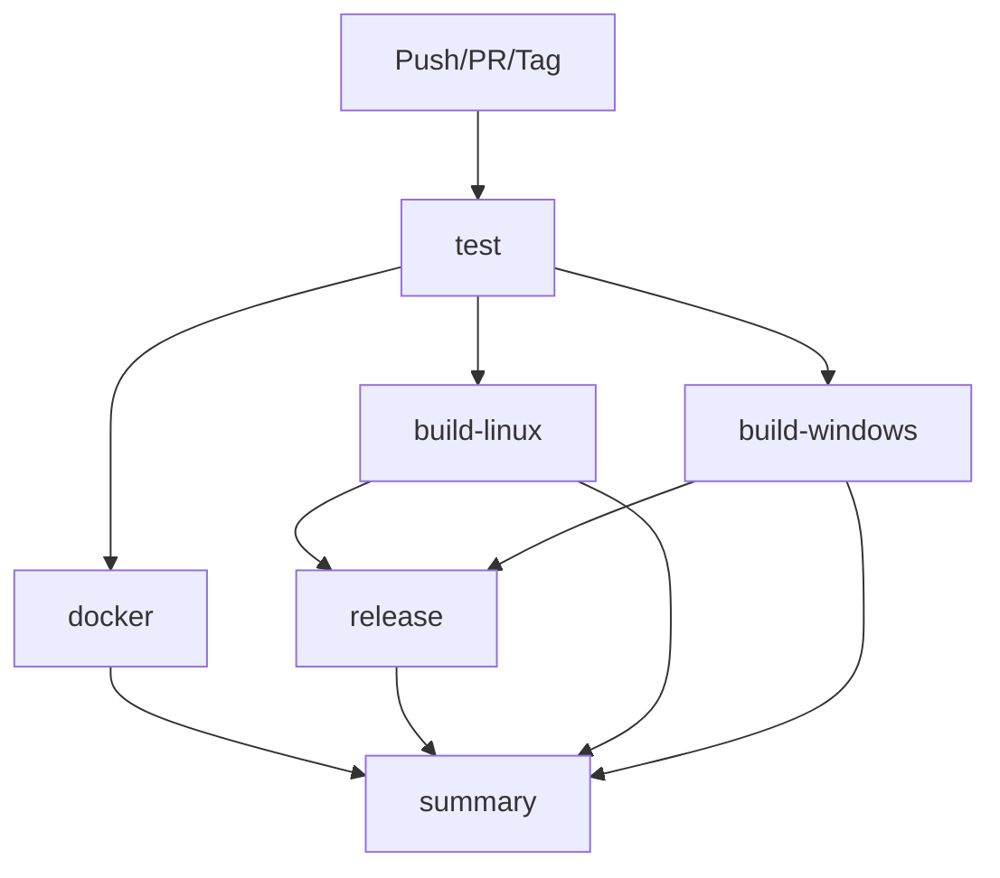

# CI/CD Pipeline Architecture

## Overview

This document describes the GitHub Actions CI/CD pipeline structure, including triggers, jobs, dependencies, and publishing mechanisms for the MLC-LLM project.

## Workflow Structure



## Triggers

### Automatic Triggers

```yaml
on:
  push:
    branches: ["main"]
    tags: ["v*"]
  pull_request:
    branches: ["main"]
  workflow_dispatch:
```

**Event Types:**

- **Push to main**: Full pipeline execution
- **Pull Request**: Testing and validation (Docker push disabled)
- **Tag push (v*)**: Full pipeline + GitHub release creation
- **Manual dispatch**: On-demand execution

## Jobs Architecture

### 1. test

**Purpose**: Validate official prebuilt packages
**Runtime**: ~5-10 minutes
**Platform**: ubuntu-latest

**Process:**

1. Install prebuilt MLC-AI packages from mlc.ai/wheels
2. Test basic imports and functionality
3. Run pytest on available test suite
4. Continue on error (allows pipeline to proceed if prebuilt fails)

**Success Criteria:**

- All imports successful
- Basic functionality tests pass
- Provides baseline for comparison

### 2. docker

**Purpose**: Build and publish multipurpose Docker image
**Runtime**: ~15-20 minutes
**Platform**: ubuntu-latest
**Dependencies**: test

**Process:**

1. Checkout repository with submodules
2. Setup Docker Buildx for advanced features
3. Login to GitHub Container Registry (GHCR)
4. Extract metadata for tagging
5. Build multi-stage Docker image
6. Push to GHCR with appropriate tags

**Skip Conditions:**

- Pull requests (no publishing)

**Tags Generated:**

- `main` (branch name)
- `v1.0.0` (version tags)
- `sha-abc123` (commit hashes)
- `latest` (default branch only)

### 3. build-linux

**Purpose**: Build Linux x64 Python wheel
**Runtime**: ~25-35 minutes
**Platform**: ubuntu-latest

**Build Process:**

1. Install system dependencies (Vulkan, SPIRV, build tools)
2. Setup Python 3.11 and Rust toolchain
3. Configure ccache for faster rebuilds
4. Build MLC-LLM libraries with CMake
5. Build Python wheel
6. Repair wheel with auditwheel for Linux compatibility
7. Verify wheel structure using community approach

**Key Features:**

- Vulkan support enabled
- CPU-optimized build
- auditwheel repair for manylinux compatibility
- Community-standard verification (no runtime TVM testing)

### 4. build-windows

**Purpose**: Build Windows x64 Python wheel
**Runtime**: ~45-60 minutes
**Platform**: windows-latest

**Build Process:**

1. Enable Git long paths support
2. Setup Miniconda environment from official config
3. Use official Windows build script (`ci/task/build_win.bat`)
4. Build Python wheel
5. Verify wheel structure using community approach

**Key Features:**

- Official conda environment
- Native Windows build tools
- Long path handling for deep directory structures
- Community-standard verification

### 5. release

**Purpose**: Create GitHub release with wheel artifacts
**Runtime**: ~5 minutes
**Platform**: ubuntu-latest
**Dependencies**: build-linux, build-windows
**Trigger**: Tags starting with `v*`

**Process:**

1. Download Linux and Windows wheel artifacts
2. Prepare release assets with descriptive structure
3. Generate comprehensive release notes
4. Create GitHub release with wheels attached

**Release Notes Include:**

- TVM compatibility requirements
- Installation instructions
- Use case recommendations
- Platform compatibility matrix

### 6. summary

**Purpose**: Report overall pipeline status
**Runtime**: ~1 minute
**Platform**: ubuntu-latest
**Dependencies**: build-linux, build-windows
**Condition**: Always runs

**Output:**

- Build status for each platform
- Success/failure summary
- Next steps guidance

## Environment Configuration

### Global Environment Variables

```yaml
env:
  CARGO_INCREMENTAL: 0          # Disable incremental Rust compilation
  CARGO_PROFILE_DEV_DEBUG: 0    # Reduce debug info for faster builds
  CARGO_TERM_COLOR: always      # Colored output
  RUST_BACKTRACE: short         # Concise error traces
  RUSTFLAGS: -D warnings        # Treat warnings as errors
```

### Job-Specific Variables

```yaml
# Linux build
NUM_THREADS: ${{ github.event_name == 'pull_request' && '2' || '4' }}
CCACHE_DIR: ${{ github.workspace }}/.ccache

# Build optimization
CCACHE_COMPILERCHECK: content
CCACHE_NOHASHDIR: 1
```

## Publishing Strategy

### Docker Publishing

**Registry**: GitHub Container Registry (ghcr.io)
**Authentication**: GitHub token
**Scope**: Public repository access

**Image Capabilities:**

- Development environment (interactive shell)
- Build environment (automated compilation)
- Runtime environment (production deployment)
- CLI access (direct command execution)

### Wheel Publishing

**Method**: GitHub Releases
**Trigger**: Version tags (`v*`)
**Platforms**: Linux x64, Windows x64

**Wheel Types:**

- Source-built wheels for advanced users
- Requires compatible TVM installation
- Development and research focused

### Artifact Management

**Retention**: 30 days for CI artifacts
**Permanent**: Release assets on GitHub
**Naming**: Platform and architecture specific

## Performance Optimizations

### Build Speed

- **ccache**: Compiler caching for C++/Rust
- **Parallel builds**: Configurable thread count
- **Docker layer caching**: GitHub Actions cache
- **Conditional execution**: Skip unnecessary steps

### Resource Management

- **Timeout controls**: Prevent runaway builds
- **Memory limits**: Appropriate for platform
- **Artifact size**: Optimized wheel packaging

### Pull Request Efficiency

- **Reduced parallelism**: 2 threads vs 4 for faster feedback
- **Skip publishing**: No Docker/release steps
- **Early feedback**: Fast test execution

## Security Considerations

### Permissions

```yaml
permissions:
  contents: read    # Repository access
  packages: write   # GHCR publishing
  contents: write   # Release creation (release job only)
```

### Container Security

- Non-root user execution
- Minimal base images
- Layer optimization
- Vulnerability scanning integration ready
